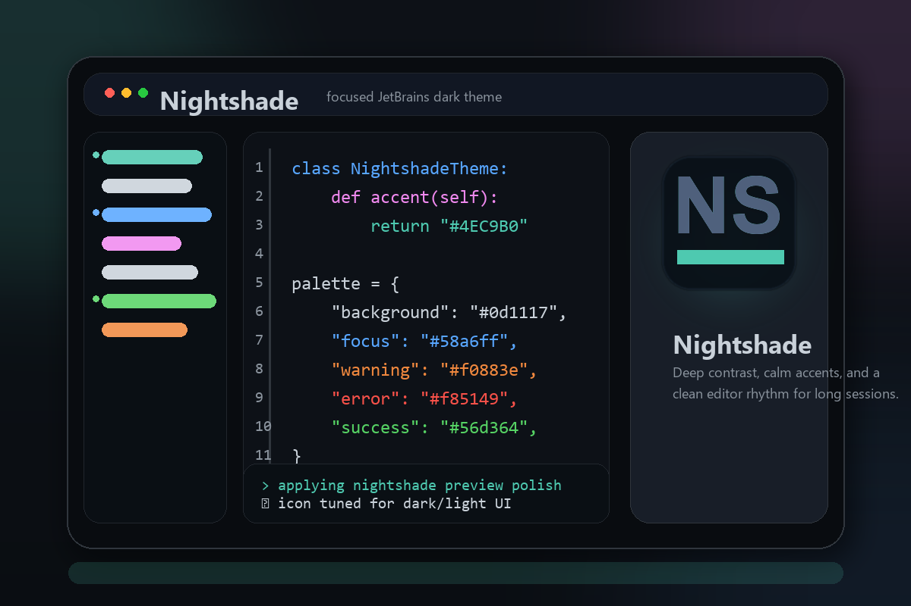

# Nightshade Theme

A sleek, modern dark theme for JetBrains IDEs, inspired by the beauty of night and the elegance of shadows.

## Overview

**Nightshade Theme** is a custom dark theme designed to provide a visually stunning and comfortable coding experience. With its deep purple tones and subtle highlights, it reduces eye strain during extended coding sessions while maintaining a professional, polished aesthetic.

## Features

- **Sleek, Modern Dark Interface** — Deep purples and subtle highlights that improve long-session comfort and reduce eye strain.
- **Optimized Syntax Highlighting** — Carefully tuned color palette for clearer code scanning and faster code understanding.
- **Modern, Clean Aesthetic Design** — Keeps your workspace focused and visually consistent across all UI elements.
- **Compatible with All JetBrains IntelliJ IDEs** — Works seamlessly with IntelliJ IDEA, PyCharm, WebStorm, Rider, and all other JetBrains IDEs.
- **FREE** — This plugin is free and always will be.

## Installation

1. Open your JetBrains IDE
2. Go to **File** → **Settings** (or **Preferences** on macOS)
3. Navigate to **Plugins**
4. Search for **Nightshade Theme**
5. Click **Install** and restart the IDE
6. Go to **Appearance & Behavior** → **Appearance** and select **Nightshade Theme**

## Manual Installation (From Disk)

If you prefer to install manually:

1. Download the latest `nightshade.jar` from the [releases](https://github.com/omostan/nightshade-theme/releases) page
2. Go to **File** → **Settings** (or **Preferences** on macOS)
3. Navigate to **Plugins** → **gear icon** → **Install Plugin from Disk...**
4. Select the `nightshade.jar` file
5. Restart the IDE and enable the theme in **Appearance & Behavior** → **Appearance**

## Preview

## Requirements

- JetBrains IDE (IntelliJ IDEA 2025.2 or later)
- Java Runtime Environment (JRE)

## License

This project is licensed under the MIT License. See the [LICENSE](LICENSE) file for details.

## Contributing

Contributions are welcome! If you'd like to suggest improvements or report issues, please open an issue or submit a pull request on [GitHub](https://github.com/omostan/nightshade-theme).

### For Maintainers & Release

- **Pre-Release Build & Validation**: See [Pre-Release Guide](docs/maintainers/PRE_RELEASE_GUIDE.md) for automated build/release checks
- **Signing & Publishing**: See [Signing and Publishing Guide](docs/maintainers/SIGNING_AND_PUBLISHING.md)

## Author

**Stanley Omoregie**
- GitHub: [@omostan](https://github.com/omostan)
- Email: stan@omotech.com

---

Made with ❤️ for the JetBrains community.

